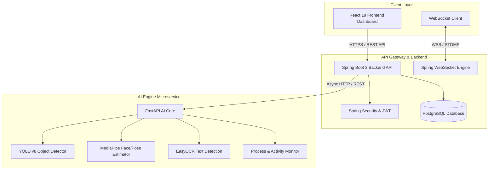
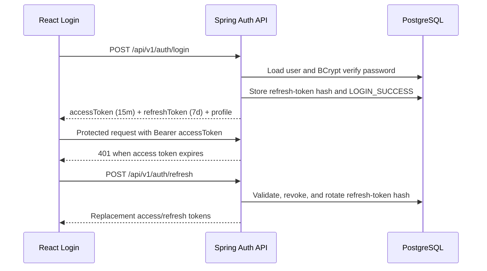

# SentinelAI – Enterprise AI-Powered Unauthorized Screen Recording & Insider Threat Detection Platform


SentinelAI is an enterprise-grade threat monitoring and DLP (Data Loss Prevention) platform engineered to detect unauthorized screen recording, external camera capture, insider suspicious activity, and confidential data exfiltration in real time.

---

## 🏗 System Architecture



---

## 🛠 Technology Stack

### Frontend
- **Framework**: React 19 + Vite
- **Styling**: TailwindCSS (Modern Dark Mode & Glassmorphism Design System)
- **State & Data Fetching**: TanStack React Query v5, Context API
- **Routing**: React Router v6
- **Forms & Validation**: React Hook Form + Zod
- **Visualizations**: Recharts
- **Icons**: Lucide React

### Backend
- **Framework**: Java 21 + Spring Boot 3.2
- **Security**: Spring Security + Stateful/Stateless JWT Authentication & RBAC
- **Persistence**: Spring Data JPA + Hibernate + PostgreSQL
- **Real-Time Engine**: Spring WebSocket + STOMP Messaging
- **Documentation**: OpenAPI 3.0 / Swagger UI
- **Utilities**: Lombok, Jackson, SLF4J

### AI Engine
- **Framework**: Python 3.12 + FastAPI + Uvicorn
- **Computer Vision**: OpenCV, Ultralytics YOLOv8, MediaPipe
- **Text & OCR**: EasyOCR
- **System Monitoring**: `psutil`
- **Schema & Validation**: Pydantic v2

---

## 📁 Repository Directory Structure

```
sentinel-ai/
├── docker-compose.yml          # Multi-container orchestration
├── .env.example                # Centralized environment configurations
├── README.md                   # System documentation
├── deployments/                # Kubernetes, Docker, & Nginx manifests
├── scripts/                    # Database migrations & setup utility scripts
├── shared/                     # Shared OpenAPI schemas & API contracts
├── docs/                       # Architecture diagrams & API reference docs
├── frontend/                   # React 19 UI Dashboard Web Application
├── backend/                    # Spring Boot 3 Core Backend Service
└── ai-engine/                  # FastAPI Computer Vision & Threat Engine
```

---

## 🚀 Quick Start Guide (Docker Compose)

### Prerequisites
- [Docker Desktop](https://www.docker.com/products/docker-desktop/) (v24+)
- [Git](https://git-scm.com/)

### Step 1: Clone & Configure
```bash
git clone https://github.com/your-org/sentinel-ai.git
cd sentinel-ai
cp .env.example .env
```

### Step 2: Spin Up Infrastructure & Application
```bash
docker-compose up --build -d
```

### Access Points:
- **Frontend Dashboard**: `http://localhost:3000`
- **Backend Spring API**: `http://localhost:8080/api/v1`
- **Backend Swagger UI**: `http://localhost:8080/swagger-ui.html`
- **AI Engine FastAPI Docs**: `http://localhost:8000/docs`
- **PostgreSQL Database**: `localhost:5432` (Database: `sentinel_db`)

---

## 🧪 Local Manual Development Setup

### 1. Backend (Spring Boot)
```bash
cd backend
mvn clean install

# Git Bash: create a per-shell development secret; do not commit it.
export JWT_SECRET="$(openssl rand -base64 32)"
export DEFAULT_ADMIN_EMAIL="admin@sentinelai.local"
export DEFAULT_ADMIN_PASSWORD="change-this-local-password"

mvn spring-boot:run
```

Spring Boot does not automatically read the repository root `.env` file. In
Git Bash, load a local `.env` file before starting the backend with
`set -a; source ../.env; set +a`, after replacing all placeholder values.
In PowerShell, use:

```powershell
$bytes = [byte[]](1..32 | ForEach-Object { Get-Random -Maximum 256 })
$env:JWT_SECRET = [Convert]::ToBase64String($bytes)
$env:DEFAULT_ADMIN_EMAIL = "admin@sentinelai.local"
$env:DEFAULT_ADMIN_PASSWORD = "change-this-local-password"
mvn spring-boot:run
```

If Maven is not on `PATH` in Git Bash, invoke a Windows Maven installation as
`"/c/Tools/apache-maven-3.9.14/bin/mvn.cmd" spring-boot:run`. The form
`C:\Tools\...\mvn.cmd` is interpreted incorrectly by Git Bash.

The backend expects PostgreSQL at `localhost:5432` by default. Start the
database with `docker compose up -d postgres` or provide `DB_HOST`, `DB_PORT`,
`DB_NAME`, `DB_USER`, and `DB_PASSWORD` for another PostgreSQL instance.

### 2. AI Engine (FastAPI)
```bash
cd ai-engine
python -m venv venv
# On Windows:
.\venv\Scripts\activate
# On Linux/macOS:
source venv/bin/activate

pip install -r requirements.txt
uvicorn app:app --reload --port 8000
```

### 3. Frontend (React + Vite)
```bash
cd frontend
npm install
npm run dev
```

---

## 🛰 Core API Specification (Endpoints Overview)

### Auth & Security
- `POST /api/v1/auth/login` - Authenticate by email and issue access/refresh tokens
- `POST /api/v1/auth/refresh` - Rotate a refresh token and issue a new access token
- `POST /api/v1/auth/logout` - Revoke the submitted refresh token
- `GET /api/v1/auth/me` - Return the authenticated safe profile

### Incident & Alert Management
- `GET /api/v1/incidents` - List threat incidents with pagination & filters
- `POST /api/v1/incidents` - Log a new insider threat incident
- `GET /api/v1/alerts` - Fetch real-time security alerts

### AI Engine Threat Endpoints
- `POST /process-monitor` - Scan running system processes for unauthorized tools
- `POST /screen-detection` - Analyze screen captures for recording software
- `POST /webcam-monitor` - Detect secondary recording devices or suspicious camera feed
- `POST /object-detection` - Detect mobile phones/cameras in workspace
- `POST /face-detection` - Detect multi-person or unauthorized observer looking at screen
- `POST /risk-score` - Calculate real-time employee risk score index
- `POST /ocr` - Extract confidential text on screen

---

## 🔒 Security & Compliance
- **Role-Based Access Control (RBAC)**: `ADMIN`, `SECURITY_OFFICER`, `EMPLOYEE`, enforced by Spring Security on the backend
- **Audit Logging**: Authentication success, failure, disabled-account, refresh, and logout events are persisted in `activity_logs`
- **JWT Standard**: HMAC signing with a 15-minute access token and seven-day rotating, hashed refresh tokens
- **Password Security**: BCrypt password hashes only; password, JWT secret, and raw refresh tokens are never persisted in logs

## Authentication V1

Authentication is stateless at the API layer. PostgreSQL stores users, roles, refresh-token hashes, and authentication activity events. Roles are seeded idempotently on startup. An initial administrator is created only when both `DEFAULT_ADMIN_EMAIL` and `DEFAULT_ADMIN_PASSWORD` are supplied through the environment.



Authorization matrix:

| Capability | ADMIN | SECURITY_OFFICER | EMPLOYEE |
|---|---:|---:|---:|
| Dashboard and monitoring | Yes | Yes | Yes |
| Incidents, alerts, reports, analytics | Yes | Yes | No |
| Policies, users, settings | Yes | No | No |

The academic frontend stores access and refresh tokens in isolated `localStorage` keys because the current Vite/Spring setup does not yet provide a same-site HTTPS cookie boundary. Production deployment should move the refresh token to a Secure, HttpOnly, SameSite cookie and serve the application over HTTPS.

Required authentication environment variables:

```text
JWT_SECRET
JWT_ACCESS_EXPIRATION=900000
JWT_REFRESH_EXPIRATION=604800000
DEFAULT_ADMIN_EMAIL
DEFAULT_ADMIN_PASSWORD
FRONTEND_URL=http://localhost:3000
```

---

## 📜 License & Support
Distributed under the MIT License. See `LICENSE` for more information.
